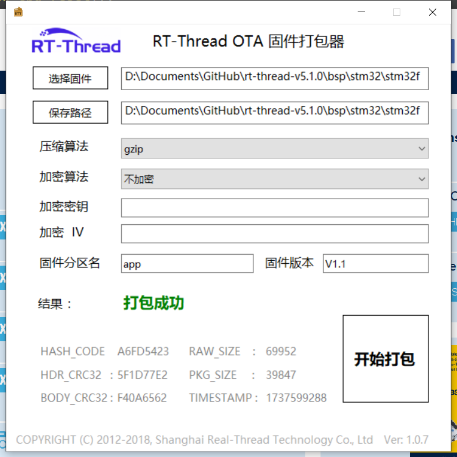

<!--
 * @Author: TOTHTOT 37585883+TOTHTOT@users.noreply.github.com
 * @Date: 2025-01-09 22:54:57
 * @LastEditors: TOTHTOT 37585883+TOTHTOT@users.noreply.github.com
 * @LastEditTime: 2025-01-22 17:35:00
 * @FilePath: \stm32f103_rtt_temp\README.md
 * @Description:项目说明
-->

# stm32f103 qboot模板工程

## ~~项目存放位置~~

- ~~需要位于`rt_thread 根目录\bsp\stm32\stm32f103_rtt_temp`~~

## ~~使用方法~~

- ~~`使用`env`工具配置工程;~~
  - ~~`menuconfig` 配置工程;~~
  - ~~`scons --target=mdk5` 在配置完成后重新生成MDK5工程;~~
  - ~~`pkgs --upgrade` 下载并更新所有包;~~

## ~~项目说明~~

- ~~适用于`stm32f103`系列芯片;~~
- ~~和rt thread 内核源码分离, 需要位于系统的`bsp`目录下;~~
- ~~配置分区功能在`board\ports\fal_cfg.h`;~~
- ~~`RT_APP_PART_ADDR`位置要和`app`分区的一样;~~

---


## 此项目已经遗弃, 改为使用rt thread 官方通用boot loader

----

## 官方 boot loader 配置方式

- 官网链接:[iot_admin](https://iot.rt-thread.com/#/addBootloader)

- ota工具链接:[ota_downloader: 用于 OTA 升级的固件下载器，使用 RT-Thread 的 OTA 组件 - Gitee.com](https://gitee.com/jzhiyu/ota_downloader/tree/master)

- 配置`boot loader`的参数, 目前只支持`stm32`的`f1,f4,l4`系列

```json
{"MCU_SERIES":"f1","RT_BL_ROM_SIZE":"256","RT_BL_SRAM_SIZE":"48","BL_USING_UART":"y","RT_BL_UART_TX_PIN_NUM":"PA9","BL_USING_SPI_FLASH":"n","RT_BL_SPI_FLASH_CS_PIN_NUM":"","RT_BL_SPI_FLASH_SCK_PIN_NUM":"","RT_BL_SPI_FLASH_MISO_PIN_NUM":"","RT_BL_SPI_FLASH_MOSI_PIN_NUM":"","BL_USING_FACTORY":"n","BL_USING_FACTORY_PIN_1":"","BL_USING_FACTORY_PIN_2":"","BL_USING_FACTORY_ACTIVE_HIGH":"y","RT_BL_APP_PART_OFFSET":"0x8000","RT_BL_APP_PART_SIZE":"150","RT_BL_DOWNLOAD_PART_DEVICE_NAME":"onchip_flash","RT_BL_DOWNLOAD_PART_OFFSET":"0x0002d800","RT_BL_DOWNLOAD_PART_SIZE":"74","RT_BL_RE_PART_DEVICE_NAME":"onchip_flash","RT_BL_RECOVER_PART_OFFSET":"","RT_BL_RECOVER_PART_SIZE":"","BL_USING_TINYCRYPT":"n","KEY_HEX":"","IV_HEX":"","BL_USING_FASTLZ":"n","BL_USING_QUICKLZ":"n","BL_USING_ZLIB":"y","BL_USING_NEW_LOGO":"n","BL_NEW_LOGO_CONTENT":"","BL_USER_EMAIL":"mczyfs@gmail.com","COMPRESS_MODE":"gzip"}
```

- 生成程序后使用`j-flash`烧录到单片机

```shell
 __  ___     __   __   __  ___ 
|__)  |  __ |__) /  \ /  \  |  
|  \  |     |__) \__/ \__/  |  
2006 - 2019 Copyright by rt-thread team
                0.9.2 build Jan 23 2025
[D/FAL] (fal_flash_init:63) Flash device |             onchip_flash | addr: 0x08000000 | len: 0x00040000 | blk_size: 0x00000800 |initialized finish.
[I/FAL] ==================== FAL partition table ====================
[I/FAL] | name     | flash_dev    |   offset   |    length  |
[I/FAL] -------------------------------------------------------------
[I/FAL] | app      | onchip_flash | 0x00008000 | 0x00025800 |
[I/FAL] | download | onchip_flash | 0x0002d800 | 0x00012800 |
[I/FAL] =============================================================
[I/FAL] RT-Thread Flash Abstraction Layer (V0.4.0) initialize success.
[I/FAL] System initialization successful.
[I]RT-Thread OTA package(V0.2.1) initialize success.
[E]Get firmware header occur CRC32(calc.crc: 7b93c5c8 != hdr.info_crc32: ffffffff) error on 'download' partition!
[E]Get OTA download partition firmware header failed!
[I]Verify 'app' partition(fw ver: V1.1, timestamp: 1737599288) success.
[I/FAL] Find user firmware at app partition 0x08008000 successfully.
[I/FAL] Bootloader jumps to user firmware now.


```

## app 相关配置

- 使能`ymodem`和`fal`, `ota_downloader`;

- 配置`app`的`fal_cfg.h`, 主要修改`FAL_PART_TABLE`, 分区配置要和`loader`一样

```c
#define FAL_PART_TABLE                                                                \
    {                                                                                 \
        {FAL_PART_MAGIC_WORD, "app", "onchip_flash", 32 * 1024, 150 * 1024, 0},       \
        {FAL_PART_MAGIC_WORD, "download", "onchip_flash", 182 * 1024, 72 * 1024, 0}, \
    } 
```

- `main.c`添加`extern int fal_init(void);`和`fal_init()`初始化`fal`

- 修改`board\linker_scripts\link.sct`脚本的下载位置, 参考如下, `0x0800b400`就是下载位置
  
  ```c
  LR_IROM1 0x08008000 0x00040000  {    ; load region size_region
   ER_IROM1 0x08008000 0x00040000  {  ; load address = execution address
   *.o (RESET, +First)
   *(InRoot$$Sections)
   .ANY (+RO)
   }
   RW_IRAM1 0x20000000 0x0000C000  {  ; RW data
   .ANY (+RW +ZI)
   }
  }
  ```

- 修改app的中断向量
  
  ```c
  static int ota_app_vtor_reconfig(void)
  {
   #define NVIC_VTOR_MASK 0x3FFFFF80
   #define RT_APP_PART_ADDR 0x08008000
   /* 根据应用设置向量表 */
   SCB->VTOR = RT_APP_PART_ADDR & NVIC_VTOR_MASK;
  
   return 0;
  }
  INIT_BOARD_EXPORT(ota_app_vtor_reconfig);
  ```

- 在`application`中添加`ymodem_update.c`文件

```c
/*
 * Copyright (c) 2006-2018, RT-Thread Development Team
 *
 * SPDX-License-Identifier: Apache-2.0
 *
 * Change Logs:
 * Date           Author       Notes
 * 2018-01-30     armink       the first version
 * 2018-08-27     Murphy       update log
 */

#include <rtthread.h>
#include <stdio.h>
#include <stdbool.h>
#include <finsh.h>
#include <fal.h>
#include <ymodem.h>

#define DBG_ENABLE
#define DBG_SECTION_NAME               "ymodem"
#ifdef OTA_DOWNLOADER_DEBUG
#define DBG_LEVEL                      DBG_LOG
#else
#define DBG_LEVEL                      DBG_INFO
#endif
#define DBG_COLOR
#include <rtdbg.h>

#ifdef PKG_USING_YMODEM_OTA

#define DEFAULT_DOWNLOAD_PART "download"

static char* recv_partition = DEFAULT_DOWNLOAD_PART;
static size_t update_file_total_size, update_file_cur_size;
static const struct fal_partition * dl_part = RT_NULL;

static enum rym_code ymodem_on_begin(struct rym_ctx *ctx, rt_uint8_t *buf, rt_size_t len)
{
    char *file_name, *file_size;

    /* calculate and store file size */
    file_name = (char *)&buf[0];
    file_size = (char *)&buf[rt_strlen(file_name) + 1];
    update_file_total_size = atol(file_size);
    rt_kprintf("Ymodem file_size:%d\n", update_file_total_size);

    update_file_cur_size = 0;

    /* Get download partition information and erase download partition data */
    if ((dl_part = fal_partition_find(recv_partition)) == RT_NULL)
    {
        LOG_E("Firmware download failed! Partition (%s) find error!", recv_partition);
        return RYM_CODE_CAN;
    }

    if (update_file_total_size > dl_part->len)
    {
        LOG_E("Firmware is too large! File size (%d), '%s' partition size (%d)", update_file_total_size, recv_partition, dl_part->len);
        return RYM_CODE_CAN;
    }

    LOG_I("Start erase. Size (%d)", update_file_total_size);

    /* erase DL section */
    if (fal_partition_erase(dl_part, 0, update_file_total_size) < 0)
    {
        LOG_E("Firmware download failed! Partition (%s) erase error!", dl_part->name);
        return RYM_CODE_CAN;
    }

    return RYM_CODE_ACK;
}

static enum rym_code ymodem_on_data(struct rym_ctx *ctx, rt_uint8_t *buf, rt_size_t len)
{
    /* write data of application to DL partition  */
    if (fal_partition_write(dl_part, update_file_cur_size, buf, len) < 0)
    {
        LOG_E("Firmware download failed! Partition (%s) write data error!", dl_part->name);
        return RYM_CODE_CAN;
    }

    update_file_cur_size += len;

    return RYM_CODE_ACK;
}

void ymodem_ota(uint8_t argc, char **argv)
{
    struct rym_ctx rctx;

    if (argc < 2)
    {
        recv_partition = DEFAULT_DOWNLOAD_PART;
        rt_kprintf("Default save firmware on download partition.\n");
    }
    else
    {
        const char *operator = argv[1];
        if (!strcmp(operator, "-p")) {
            if (argc < 3) {
                rt_kprintf("Usage: ymodem_ota -p <partiton name>.\n");
                return;
            } else {
                /* change default partition to save firmware */
                recv_partition = argv[2];  
            }
        }else{
            rt_kprintf("Usage: ymodem_ota -p <partiton name>.\n");
            return;
        }
    }

    rt_kprintf("Warning: Ymodem has started! This operator will not recovery.\n");
    rt_kprintf("Please select the ota firmware file and use Ymodem to send.\n");

    if (!rym_recv_on_device(&rctx, rt_console_get_device(), RT_DEVICE_OFLAG_RDWR | RT_DEVICE_FLAG_INT_RX,
                            ymodem_on_begin, ymodem_on_data, NULL, RT_TICK_PER_SECOND))
    {
        rt_kprintf("Download firmware to flash success.\n");
        rt_kprintf("System now will restart...\r\n");

        /* wait some time for terminal response finish */
        rt_thread_delay(rt_tick_from_millisecond(200));

        /* Reset the device, Start new firmware */
        extern void rt_hw_cpu_reset(void);
        rt_hw_cpu_reset();
        /* wait some time for terminal response finish */
        rt_thread_delay(rt_tick_from_millisecond(200));
    }
    else
    {
        /* wait some time for terminal response finish */
        rt_thread_delay(RT_TICK_PER_SECOND);
        rt_kprintf("Update firmware fail.\n");
    }

    return;
}
/**
 * msh />ymodem_ota
*/
MSH_CMD_EXPORT(ymodem_ota, Use Y-MODEM to download the firmware);

#endif /* PKG_USING_YMODEM_OTA */


```

- 使用`ymodem_ota`命令进入下载, 使用`xshell`发送软件;

- ota工具配置如下

- 
